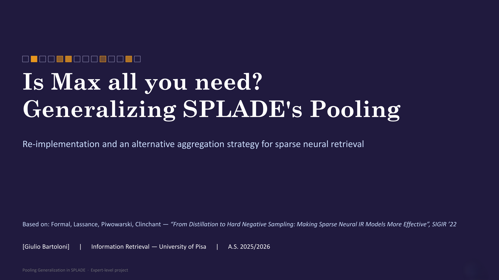

## About

This repository re-implements the SPLADE sparse neural retriever from scratch and extends it by generalizing its **pooling function**: the step that collapses per-token vocabulary predictions into a single sparse document/query vector.

It is based on:

> T. Formal, C. Lassance, B. Piwowarski, S. Clinchant.
> *From Distillation to Hard Negative Sampling: Making Sparse Neural IR Models More Effective.* SIGIR '22.
> arXiv:2205.04733


> The official [`naver/splade`](https://github.com/naver/splade) repository is used **only as a reference** for validating this re-implementation — the model code here is written from scratch.

## Research question

SPLADE's original result showed that `max` pooling clearly beats `sum`. But `max` and `sum` are the two endpoints of a single family. This project asks:

- Is `max` actually **optimal**, or merely better than `sum`?
- Can a **learnable** aggregator (p-norm with a trainable exponent, or attention pooling) match or beat it?
- Does the best pooling **differ for queries vs documents** (short vs long inputs)?


## Pooling variants

All variants live behind one interface in `src/pooling.py`:

| Variant | Params | Notes |
|---|---|---|
| `sum` | 0 | Only implemented to practice pytorch. |
| `max` | 0 | Baseline, only implemented to match paper. |
| `p-norm` | 1 (learnable `p`) | Interpolates mean↔max; log-sum-exp form for numerical stability; init `p` high. |
| `attention` | many | Learned per-position weights. |

## Repository structure

```
splade-pooling
├── data/  
│   ├── ir_datasets  
│   │    ├── ...
│   │    ├── msmarco-passage 
│   │    └── ...       
│   └── teacher             
├── results/ 
│   ├── train_logs       
│   ├── metrics.csv       
│   └── runs.csv 
├── src/         
│   ├── data.py    
│   └── evaluate.py       
│   ├── index.py       
│   ├── loss.py   
│   ├── model.py        
│   ├── pooling.py     
│   └── train.py        
├── various/               
└── README.md
```

## Data

Fixed training setting: **DistilMSE** (distillation from pre-computed cross-encoder teacher scores).

- MS MARCO passage collection + `dev` / TREC DL 2019 query sets
- Pre-computed teacher scores / DistilMSE triples


## Results

**Replication check** — our `max` re-implementation vs the released baseline:

| Model | MRR@10 (dev) | R@1k |
|---|---|---|
| `splade_v2_max` (reference) | ~34.0 | 96.6 |
| ours (`max`) | **34.4** | **96.7** |

**Pooling comparison**:

| Pooling | MRR@10 | R@100 | R@1k | FLOPS |
|---|---|---|---|---|
| `max` | **34.4** | **87.1** | **96.7** | **6.6** |
| `p-norm` | 32.4 | 85.3 | 96.3 | 7.2 |
| `attention` | 15.4 | 60.6 | 83.6 | 45.5 |


## Citation

```bibtex
@inproceedings{formal2022splade,
  title     = {From Distillation to Hard Negative Sampling: Making Sparse Neural IR Models More Effective},
  author    = {Formal, Thibault and Lassance, Carlos and Piwowarski, Benjamin and Clinchant, St{\'e}phane},
  booktitle = {Proceedings of the 45th International ACM SIGIR Conference on Research and Development in Information Retrieval},
  year      = {2022}
}
```

## Acknowledgements & license

The reference implementation [`naver/splade`](https://github.com/naver/splade) is released under **CC BY-NC-SA 4.0** (non-commercial, share-alike). This is an academic course project; check those terms before any redistribution or reuse of derived material.

